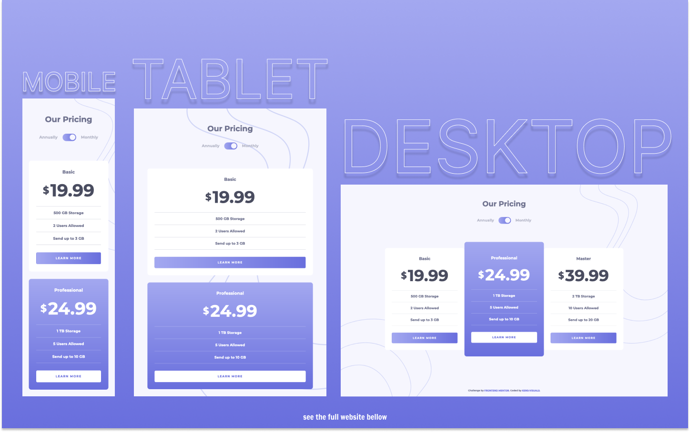

# Frontend Mentor - Pricing Component with Toggle Solution

This is a solution to the [Pricing Component with Toggle Challenge on Frontend Mentor](https://www.frontendmentor.io/challenges/pricing-component-with-toggle-8vPwRMIC).

## Table of contents

- [Overview](#overview)
  - [The challenge](#the-challenge)
  - [Screenshot](#screenshot)
  - [Links](#links)
- [My process](#my-process)
  - [Built with](#built-with)
  - [What I learned](#what-i-learned)
  - [Useful resources](#useful-resources)
- [Author](#author)

## Overview

### The challenge

Users should be able to:

- View the optimal layout for the component depending on their device's screen size
- Control the toggle with both their mouse/trackpad and their keyboard

### Screenshot

### Links

- Live Site URL: [https://kens-visuals.github.io/pricing-component-with-toggle/](https://kens-visuals.github.io/pricing-component-with-toggle/)
- Solution URL: [TO_BE_UPDATED](TO_BE_UPDATED)

## My process

### Built with

- Semantic HTML5 markup
- SCSS custom properties
- CSS Flexbox
- CSS Grid
- CSS Animations
- Vanilla JS
- Mobile-first workflow

### What I learned

Another simple project to practice some other skills other than layout. I've been putting a lot of work towards practicing animations. And this project was not an exception. I could finish the project with the bonus challenge and build it with HTML and CSS. However, I really wanted to make it more interactive. Every developer knows that when you want to make something interactive, JS is the ultimate tool for that. And adding these animations might have been possible with the checkbox hack, but I wanted something more professional.

### Useful resources

- [The “Checkbox Hack”](https://css-tricks.com/the-checkbox-hack/) - In case if you were wondering what you can do with the checkbox hack.

## Author

- Frontend Mentor - [@kens-visuals](https://www.frontendmentor.io/profile/kens-visuals)
- Codewars - [@kens_visuals](https://www.codewars.com/users/kens_visuals)
- CodePen - [@kens-visuals](https://codepen.io/kens-visuals)
